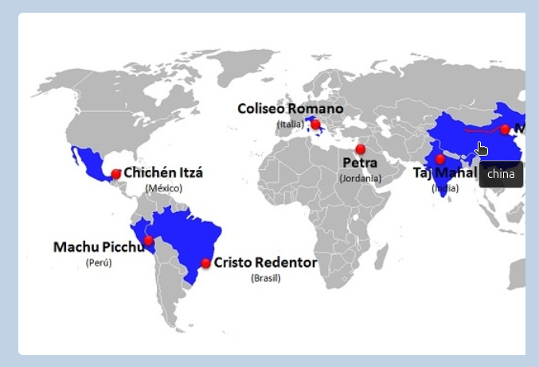
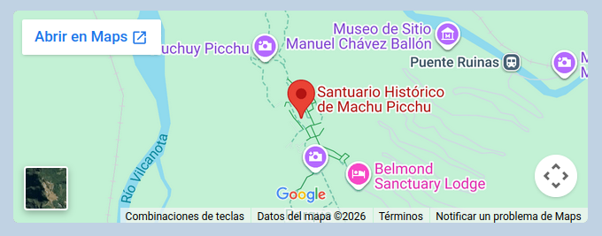
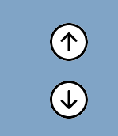
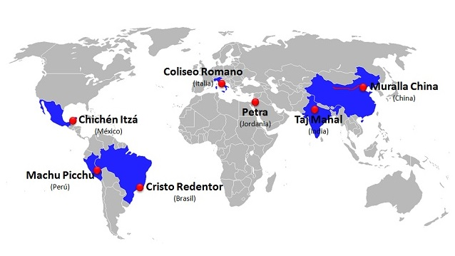

# LAS 7 MARAVILLAS DEL MUNDO MODERNO
Este proyecto es una página web desarrollada en **HTML y CSS** que presenta información sobre las **7 Maravillas del Mundo Moderno**. Combina contenido visual, multimedia e interactivo para ofrecer una experiencia atractiva al usuario.


## Maravillas incluidas

This project is used by the following companies:

- Machu Picchu (Perú)  
- Petra (Jordania)  
- Gran Muralla China (China)  
- Coliseo (Italia)  
- Chichén Itzá (México)  
- Cristo Redentor (Brasil)  
- Taj Mahal (India) 

## Tecnologías utilizadas

- HTML5  
- CSS3  
- Google Fonts  
- Bootstrap Icons  
- Google Maps (embebido)  

## Características principales

- Galería de imágenes  
- Diseño responsive básico  
- Video de fondo en el header 
- Marquesina animada 
 
- Música de fondo automática  
- Mapa interactivo con enlaces a cada maravilla 
  

- Ubicación de cada maravilla con Google Maps
     
- Botones de navegación (subir/bajar)  
   


## Checklist de requisitos

- [x] Uso de etiquetas semánticas
### Estructura de etiquetas semánticas
```html
- <header>  
  - <nav>  
- <article>  
- <article> <!-- (x7 en total) -->
- <footer>  

```
- [x] Estructura HTML correcta  
### Estructura del proyecto
```html
<!DOCTYPE html> 
- <html>  
  - <head>  
  - <body>  
    - <header>  
    - <div> <!---(marquesina / botones / audio) -->
    - <div>  <!---(contenido) -->
      - <article>  
      - <article> <!---(x7) -->
    - <footer>

```  
- [x] Coordenadas en al menos 5 países  
### Mapa de coordenadas
```html
  <div class="mapaImagen">
                    
                    <map name="image-map">
                        <area alt="peru" title="peru" href="#peru"
                            coords="142,254,136,249,129,245,124,237,121,227,122,220,135,218,132,226,135,233,140,237,145,241,143,248,145,241,140,237"
                            shape="poly">
                        ...
                    </map>
                </div>
```
- [x] Mínimo 5 enlaces internos  
### Enlaces internos
```html
<area alt="italia" title="italia" href="#italia" ...>

<article id="italia">

```
- [x] Un artículo por cada enlace interno 
### Articulo

```html
<article id="italia">
                <h2><a href="https://es.wikipedia.org/wiki/Coliseo" target="_blank">EL COLISEO</a></h2>
                ...
            </article>

```

- [x] Un enlace externo en cada artículo  
### Enlaces externos
```html
 <h2><a href="https://es.wikipedia.org/wiki/Coliseo" target="_blank">EL COLISEO</a></h2>
```
- [x] Enlaces externos con `target="_blank"`  

## Estructura del proyecto

/maravillas-del-mundo  
├── index.html  
├── multimedia/  
│   ├── audios/  
│   ├── imagenes/  
│   └── videos/  
├── readme.md

## Navegación
- Menú superior con enlaces externos (Tours, Blog, Contacto)
- Mapa interactivo para acceder a cada sección
- Botones flotantes para desplazamiento rápido

## Authors

- [@mina-45b](https://github.com/mina-45b) 


